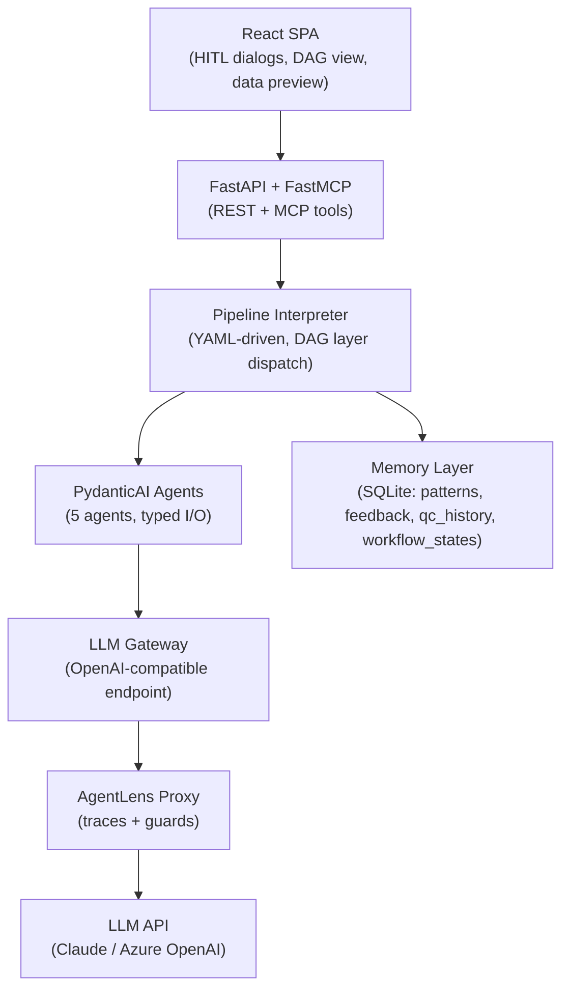
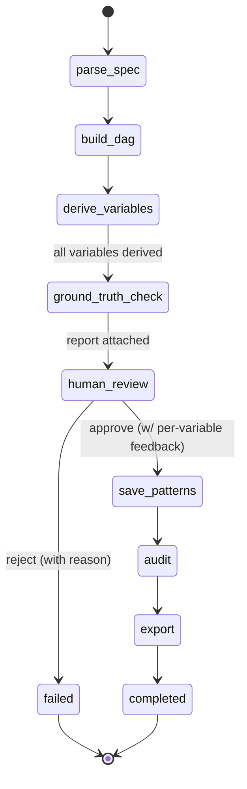
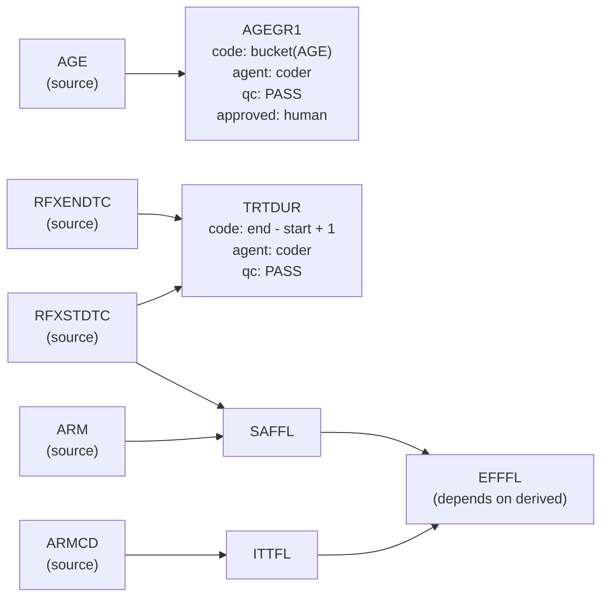

# Design Document — Clinical Data Derivation Engine (CDDE)

**Author:** Matthieu Boujonnier | **Date:** April 2026 | **Version:** 1.0

---

## 1. System Architecture

CDDE automates the SDTM-to-ADaM derivation step of the clinical trial data pipeline. The system reads a YAML transformation specification and structured SDTM data (XPT format), dispatches five specialized AI agents to generate, verify, and audit derivation code, and outputs analysis-ready ADaM datasets with a complete audit trail.

The backend follows a strict layered design enforced by 19 import-linter contracts plus 10 custom AST-based pre-commit checks:

```
domain/          (pure Python: models, DAG, spec parsing, ground truth comparison)
   ↑
agents/          (PydanticAI agent definitions + shared tools)
   ↑
engine/          (YAML pipeline interpreter, DAG execution, step executors)
   ↑
verification/ + audit/ + persistence/
   ↑
api/             (FastAPI REST + FastMCP 3.0 server)
```

The frontend is a separate **Vite + React 18 + TypeScript SPA** in `frontend/`, consuming the FastAPI backend via a typed TanStack Query client. The two services are independently deployable and compose via Docker (see §8).

**Key design choice:** PydanticAI for typed agent abstractions (`Agent[DepsType, OutputType]`) + custom Python async orchestration for clinical workflow control. We evaluated CrewAI but rejected it: `async_execution` has known bugs (PR #2466), `human_input` is CLI-only, and structured output is bolted-on rather than native. PydanticAI passed all five orchestration patterns in prototype validation (parallel agents via `asyncio.gather` arrived within 0.01s).



The engine is study-agnostic: the same code processes any spec. We validate against the **CDISC Pilot Study (cdiscpilot01)** -- an Alzheimer's anti-dementia trial with 7 ADSL derivations (AGEGR1, TRTDUR, SAFFL, ITTFL, EFFFL, DISCONFL, DURDIS).

---

## 2. Agent Roles

Five agents mirror the real pharma workflow -- each with a distinct cognitive task:

| Agent | Output Type | Role | Why Separate? |
|-------|------------|------|---------------|
| **Spec Interpreter** | `SpecInterpretation` | Parse YAML spec, extract structured rules, flag ambiguities | Document understanding is not code generation |
| **Derivation Coder** | `DerivationCode` | Generate Python derivation functions from rules | Primary programmer (regulatory role) |
| **QC Programmer** | `DerivationCode` | Independently re-implement the same derivation | Must NOT see primary code -- regulatory double programming (ICH E6) |
| **Debugger** | `DebugAnalysis` | Diagnose divergences between Coder and QC outputs | Debugging requires different reasoning than generation |
| **Auditor** | `AuditSummary` | Generate lineage reports and compliance checklists | Compliance review is independent from production |

**Double programming** is the critical differentiator. In regulated pharma, FDA expects every derived variable to be independently verified by a second programmer. The QC agent has a different system prompt (encouraging alternative implementation strategies), isolated conversation history, and its output is compared programmatically -- including an AST similarity check (>80% similarity flags "insufficient independence"). This is not testing; it is a regulatory requirement.

All agents produce validated Pydantic output types. PydanticAI retries automatically on malformed responses.

---

## 3. Orchestration

Clinical derivation workflows cannot use off-the-shelf orchestration, and hardcoding one fixed workflow in Python would leave no room for per-study variation. CDDE uses a **YAML-driven pipeline interpreter** (`src/engine/pipeline_interpreter.py`): each pipeline is a YAML file in `config/pipelines/` listing step definitions, and the interpreter topologically sorts the DAG of steps and dispatches each one through a typed executor from `STEP_EXECUTOR_REGISTRY`. Adding a new workflow variant is a YAML edit, not a code change.

Five orchestration patterns are implemented as step types:

| Pattern | Step type | Where used | Why clinical workflows need it |
|---|---|---|---|
| **Sequential** | `builtin`, `agent` | parse_spec → build_dag → audit → export | Each phase depends on the previous |
| **Fan-out / fan-in** | `parallel_map` | `derive_variables` over DAG layers | Derive AGEGR1 and TRTDUR concurrently |
| **Concurrent + compare** | inside `parallel_map` | Coder + QC on same variable | Double programming requires isolated parallel execution |
| **Retry + escalation** | inside `derivation_runner` | QC mismatch → Debugger → human | Max 2 Debugger attempts before human escalation |
| **HITL gate** | `hitl_gate` | `human_review` (and `spec_approval` / `final_signoff` in enterprise mode) | Regulatory workflows require human sign-off |

Three pipelines ship in `config/pipelines/`: **`clinical_derivation.yaml`** (8 steps, 1 deep HITL gate, default), **`express.yaml`** (4 steps, no QC, no HITL — rapid prototyping), and **`enterprise.yaml`** (9 steps, 3 HITL gates, target for 21 CFR Part 11 regulated deployments).

Workflow state is tracked by a lightweight `PipelineFSM` whose states are **auto-derived from the step IDs of whichever pipeline is running** — so `clinical_derivation.yaml` and `enterprise.yaml` get distinct FSM topologies without any code duplication. A typical `clinical_derivation` run advances through:



Every state transition emits an `AuditAction` event (`STEP_STARTED`, `STEP_COMPLETED`, `HITL_GATE_WAITING`, `HUMAN_APPROVED`, `HUMAN_REJECTED`, `HUMAN_OVERRIDE`, `WORKFLOW_FAILED`) and is persisted by `WorkflowStateRepository` per step, so a run that dies halfway can be resumed from the last completed checkpoint. Parallel dispatch uses `asyncio.gather` inside `ParallelMapStepExecutor` — the concurrency topology (which variables run in parallel) is derived from the DAG's topological layers at runtime.

---

## 4. Dependency Handling

The DAG in `src/domain/dag.py` is an **enhanced dependency graph** -- not just execution order, but lineage + computation + audit in every node:



The engine reads `source_columns` from the spec and detects dependencies automatically: if EFFFL lists ITTFL and SAFFL (both derived), the DAG ensures they are computed first. `networkx` topological sort determines layer execution order. Cycles are detected and rejected loudly.

Each DAG node (`src/domain/models.py: DAGNode`) carries: derivation rule, generated code, agent provenance, QC status, and human approval -- making the graph the single source of truth for execution, lineage, and audit.

---

## 5. Human-in-the-Loop

CDDE deliberately favours **depth over count** for HITL gates — the clinical_derivation pipeline has **one** gate (`human_review`) but three distinct actions, each backed by a REST endpoint and a React dialog, each persisting to `FeedbackRepository`:

| Action | Endpoint | What the reviewer does | What gets persisted |
|---|---|---|---|
| **Approve with feedback** | `POST /workflows/{id}/approve` | Opens `ApprovalDialog`, sees per-variable checkboxes defaulting to approved, unchecks any variable that needs rework, optionally adds a free-text note | One `FeedbackRow` per `VariableDecision`, `action_taken` = `approved` / `rejected` per row |
| **Reject with reason** | `POST /workflows/{id}/reject` | Opens `RejectDialog`, enters a mandatory reason | Workflow-level `FeedbackRow`, `HUMAN_REJECTED` audit event; FSM fails cleanly via `WorkflowRejectedError` (inherits from `Exception`, not `BaseException`) |
| **Override code** | `POST /workflows/{id}/variables/{var}/override` | Opens `CodeEditorDialog`, edits the approved pandas expression, provides a mandatory change reason | New code is executed on `derived_df` *before* state mutation; on success the DAG node, audit trail, and `FeedbackRow` are all committed in one transaction; on failure the original code is preserved and the dialog shows the 400 response inline |

**Why one deep gate, not four shallow ones:** every HITL gate is a reviewer context switch. Clinical SMEs are expensive; their time is the bottleneck. A single rich dialog where the reviewer scans all variables at once, ticks or unticks in bulk, and confirms is cheaper to operate than four separate interruptions. The depth-over-count ADR (`decisions.md`, 2026-04-13) walks through the alternatives considered.

**Enterprise mode is different.** `enterprise.yaml` keeps 3 gates (`spec_approval`, `variable_review`, `final_signoff`) for 21 CFR Part 11 deployments where regulation mandates separation of sign-off duties. Same engine, different pipeline YAML — no code fork.

**Rejection path is the tricky one.** Early design tried `task.cancel()` on reject, which raises `asyncio.CancelledError` — a `BaseException`, not an `Exception`. The existing `_run_and_cleanup`'s `except Exception` would have leaked the task. The shipped solution uses a flag-pattern: `WorkflowManager.reject_workflow` sets `ctx.rejection_requested = True` and `ctx.rejection_reason`, writes feedback, then releases the HITL event. The `HITLGateStepExecutor` wakes from `event.wait()`, checks the flag, and raises `WorkflowRejectedError(reason)` — which inherits from `CDDEError → Exception` and routes through the existing fail path with zero new error handling. One integration test specifically verifies the FSM reaches `failed` cleanly.

Human feedback is stored alongside the approved patterns in long-term memory (next section). When a reviewer overrides a derivation (e.g., changes `>=` to `>`), that correction is persisted with the original reason and becomes a candidate reference implementation in future runs of the same variable type.

---

## 6. Traceability

Three complementary layers, each capturing a different concern:

| Layer | Tool | What It Captures | Level |
|-------|------|-----------------|-------|
| **Trajectory tracing** | AgentLens (OTel proxy) | Every LLM call, tool invocation, agent response -- full agent trajectory | Agent |
| **Orchestration logging** | loguru | Workflow state transitions, DAG execution progress, HITL gate events | System |
| **Functional audit trail** | Custom (`src/audit/trail.py`) | Source-to-output lineage, agent provenance, human approvals, QC results | Business |

The audit trail is append-only (no record deletion) and exports to JSON for programmatic analysis and HTML for presentation. Every derivation step produces an `AuditRecord`: timestamp, agent, input hash, output hash, rule applied, QC result, human approval. This satisfies 21 CFR Part 11 traceability requirements.

---

## 7. Memory

| Type | Storage | Scope | What is stored |
|---|---|---|---|
| **Short-term (working)** | `PipelineContext` in-memory + `workflow_states` table (JSON per step) | Single workflow | DAG, `derived_df`, step outputs, rejection flags, approval events. Persisted per step so runs can resume from the last checkpoint. |
| **Long-term (validated)** | `patterns` + `feedback` + `qc_history` tables, surfaced via 3 coder tools (`query_patterns`, `query_feedback`, `query_qc_history`) | Cross-run | Approved derivation code, reviewer decisions (approve/reject/override) with reasons, QC verdict history with coder/QC approaches |

**Retrieval (concrete implementation):** The Coder agent has **three** PydanticAI LTM tools, each surfacing a distinct signal source so the LLM can weigh them by authority (human > debugger > prior agent). The system prompt instructs the coder to query them in order before generating code:

1. **`query_feedback`** (`src/agents/tools/query_feedback.py`) → `FeedbackRepository.query_by_variable(variable, limit=3)`. Returns up to 3 recent reviewer decisions (approve / reject / override) with their reasons. Each row carries an action-specific phrase: a previous **rejection** means *do not propose that approach again*; an **override** means *adopt the reviewer's strategy*. **Strongest signal** — human feedback overrides everything else.

2. **`query_qc_history`** (`src/agents/tools/query_qc_history.py`) → `QCHistoryRepository.query_by_variable(variable, limit=3)`. Returns up to 3 recent coder/QC verdict pairs with the verdict and both approaches. A previous **mismatch** flags an edge case the debugger had to resolve in a prior run — coder should avoid the same trap.

3. **`query_patterns`** (`src/agents/tools/query_patterns.py`) → `PatternRepository.query_by_type(variable_type, limit=3)`. Returns up to 3 approved patterns (code + study + approach label) from prior runs. **Use only after** the higher-authority tools have been consulted.

**Why three tools instead of one combined `query_lessons`:** keeping the sources separate preserves provenance. When the LLM sees results from three distinct tools, it can reason about *who* produced each piece of evidence — a human reviewer's rejection should weigh more than a prior auto-approved pattern. Collapsing all three into one blob would force the model to weigh evidence flat. The numbered list in the system prompt teaches the priority order through prompt structure alone, no meta-tool needed. The QC programmer agent has access to `query_patterns` only and its system prompt requires a *different* approach from any retrieved pattern — maintaining QC independence.

**Write path:** The `save_patterns` builtin runs **after** the `human_review` HITL gate and **before** `audit`. It iterates the DAG and writes one `PatternRow` + one `QCHistoryRow` per `DerivationStatus.APPROVED` node, then commits once via `BaseRepository.commit()`. `save_patterns` is deliberately **omitted from `express.yaml`** — no HITL gate means no human validation, and auto-approved express output would pollute the memory.

**Smoke test evidence:** Running `simple_mock.yaml` twice end-to-end against the live backend + mailbox responder produced `+2` rows per variable in `patterns` and `+8` rows in `qc_history` — one row per approved variable per run, with distinct `approach` strings confirming fresh writes. The FSM timeline explicitly shows `db_fsm=save_patterns` between `human_review` and `audit`. The long-term memory loop is observably real, not just test-verified.

**Ground truth as verification memory:** Phase 16.4 added a `compare_ground_truth` builtin that loads the reference ADaM XPT for the study (declared in `spec.validation.ground_truth`), inner-joins on `spec.source.primary_key` (USUBJID for CDISC), and compares each derived variable against the reference using the existing `compare_results` helper with the configured numeric tolerance. A `GroundTruthReport` attached to `PipelineContext` is surfaced via `GET /workflows/{id}/ground_truth`. This closes the gap between "coder matches QC" (double programming) and "output matches the regulator's expected result".

**Production path:** The repository interface (`src/persistence/`) abstracts storage. Switching from `sqlite+aiosqlite:///cdde.db` to `postgresql+asyncpg://...` requires only a `DATABASE_URL` environment variable change — zero code changes.

---

## 8. Trade-offs & Production Path

### Key Trade-offs

| Decision | Trade-off | Our choice |
|---|---|---|
| **Automation vs. control** | Fully autonomous derivation vs. human gates at every step | One deep HITL gate in clinical mode (3 actions: approve-with-feedback / reject-with-reason / code override); 3 separated gates in enterprise mode for 21 CFR Part 11 — same engine, different pipeline YAML |
| **LLM vs. rules** | Pure LLM code generation vs. deterministic rule engine | Hybrid: LLM generates, deterministic comparator verifies, ground-truth comparison validates against the regulator's reference, guards enforce constraints |
| **Flexibility vs. compliance** | Adaptable prompts vs. locked-down workflows | Pipelines are YAML — one engine, three ship-ready configs (express / clinical / enterprise), and per-study guard configs dial compliance independently |
| **Pipeline in code vs. YAML** | Hardcoded `run_workflow()` vs. YAML step definitions + executor registry | YAML. Adding a new workflow = new file in `config/pipelines/`, zero code changes. This is what lets us ship three pipelines from one engine. |

### Data Security: Dual-Dataset Architecture

Agents never see patient data. The LLM receives schema metadata + a synthetic reference dataset (10-20 fake rows, same structure). Tools execute on real data locally and return only aggregates (null counts, value ranges, pass/fail) -- never raw patient rows. This is the correct production architecture, not a prototype shortcut: agents need data **shape**, not data **content**. The `inspect_data` tool is the security gate.

### Production Path

| Prototype | Production |
|---|---|
| SQLite | PostgreSQL (same SQLAlchemy async models) |
| External Claude API | Azure OpenAI in Sanofi VNet (private endpoint) |
| Single-process dev server | Docker Compose (6 containers: nginx, React SPA, FastAPI + FastMCP, PostgreSQL, AgentLens, Grafana/Loki) |
| Docker Compose | Kubernetes (same images, Helm chart, HPA auto-scaling) |
| Single `config/guards.yaml` | ConfigMap per study (different compliance levels) |

The backend is stateless -- all state lives in PostgreSQL (patterns, feedback, qc_history, workflow_states). N replicas behind nginx give horizontal scaling with zero code changes. The React SPA is served as a static bundle from nginx.

---

## 9. Limitations & Future Work

- **Scope:** ADSL (subject-level) only. BDS (longitudinal per-visit) derivations are the natural next phase.
- **Spec format:** YAML only. Production systems need PDF/Word spec parsing (SAP documents).
- **Single study:** The memory architecture supports multi-study learning but it is not implemented.
- **No CDISC conformance validation:** Integration with Pinnacle 21 or equivalent is a production requirement.
- **Guard sophistication:** Current guards are rule-based. A RAG-backed Sentinel with the full CDISC Implementation Guide is the evolution path.

### Quality Evidence

**310 tests passing** (297 backend + 13 frontend component tests), pyright strict mode with 0 errors, ruff clean, **19 import-linter contracts** enforcing layer boundaries, **10 custom AST-based pre-commit checks** (domain purity, patient data leak detection, datetime safety, enum discipline, LLM gateway enforcement, repository DI enforcement, raw-SQL-in-engine ban, file/class size limits, UI-exception-leak prevention). All 18 pre-push hooks are green on `feat/yaml-pipeline` and run automatically before every push.

---

> *"Science sans conscience n'est que ruine de l'ame."* -- Rabelais
>
> In clinical AI, this is not philosophy -- it is engineering discipline. Every derivation the engine produces affects a drug approval decision. The conscience is built into the architecture: double programming, human gates, append-only audit trails, and agents that never see patient data. The system is designed so that doing the right thing is the path of least resistance.
