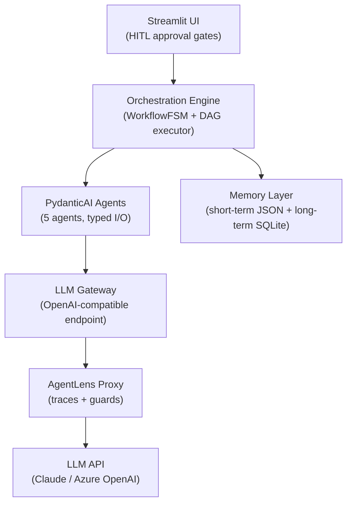
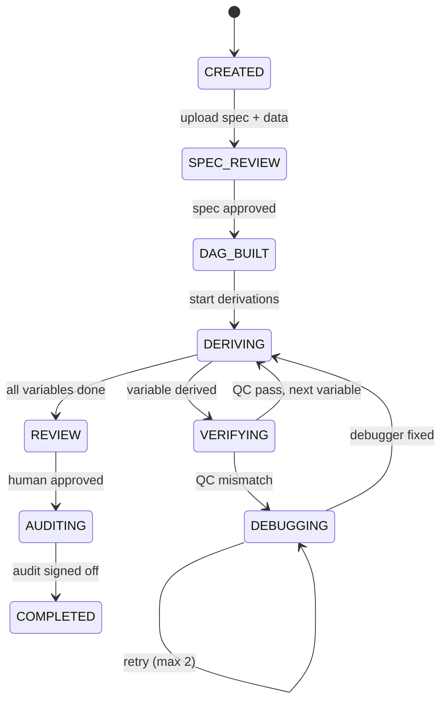
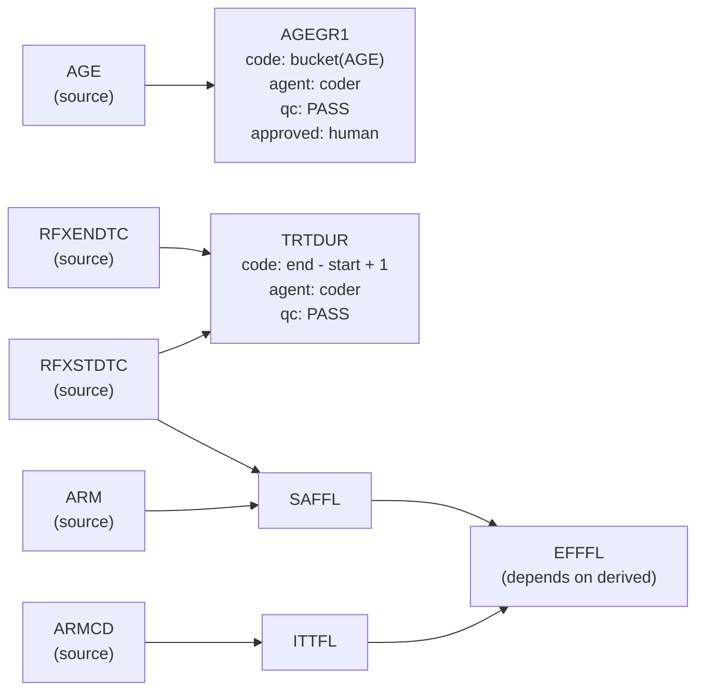

# Design Document — Clinical Data Derivation Engine (CDDE)

**Author:** Matthieu Boujonnier | **Date:** April 2026 | **Version:** 1.0

---

## 1. System Architecture

CDDE automates the SDTM-to-ADaM derivation step of the clinical trial data pipeline. The system reads a YAML transformation specification and structured SDTM data (XPT format), dispatches five specialized AI agents to generate, verify, and audit derivation code, and outputs analysis-ready ADaM datasets with a complete audit trail.

The architecture follows a strict layered design enforced by 19 import-linter contracts:

```
domain/  (pure Python: models, DAG, spec parsing)
   ↑
agents/  (PydanticAI agent definitions + shared tools)
   ↑
engine/  (orchestrator FSM, DAG execution, LLM gateway)
   ↑
ui/      (Streamlit HITL approval interface)
```

**Key design choice:** PydanticAI for typed agent abstractions (`Agent[DepsType, OutputType]`) + custom Python async orchestration for clinical workflow control. We evaluated CrewAI but rejected it: `async_execution` has known bugs (PR #2466), `human_input` is CLI-only, and structured output is bolted-on rather than native. PydanticAI passed all five orchestration patterns in prototype validation (parallel agents via `asyncio.gather` arrived within 0.01s).



The engine is study-agnostic: the same code processes any spec. We validate against the **CDISC Pilot Study (cdiscpilot01)** -- an Alzheimer's anti-dementia trial with 7 ADSL derivations (AGEGR1, TRTDUR, SAFFL, ITTFL, EFFFL, DISCONFL, DURDIS).

---

## 2. Agent Roles

Five agents mirror the real pharma workflow -- each with a distinct cognitive task:

| Agent | Output Type | Role | Why Separate? |
|-------|------------|------|---------------|
| **Spec Interpreter** | `SpecInterpretation` | Parse YAML spec, extract structured rules, flag ambiguities | Document understanding is not code generation |
| **Derivation Coder** | `DerivationCode` | Generate Python derivation functions from rules | Primary programmer (regulatory role) |
| **QC Programmer** | `DerivationCode` | Independently re-implement the same derivation | Must NOT see primary code -- regulatory double programming (ICH E6) |
| **Debugger** | `DebugAnalysis` | Diagnose divergences between Coder and QC outputs | Debugging requires different reasoning than generation |
| **Auditor** | `AuditSummary` | Generate lineage reports and compliance checklists | Compliance review is independent from production |

**Double programming** is the critical differentiator. In regulated pharma, FDA expects every derived variable to be independently verified by a second programmer. The QC agent has a different system prompt (encouraging alternative implementation strategies), isolated conversation history, and its output is compared programmatically -- including an AST similarity check (>80% similarity flags "insufficient independence"). This is not testing; it is a regulatory requirement.

All agents produce validated Pydantic output types. PydanticAI retries automatically on malformed responses.

---

## 3. Orchestration

Clinical derivation workflows cannot use off-the-shelf orchestration. The five patterns we implement in `src/engine/orchestrator.py`:

| Pattern | Where Used | Why Clinical Workflows Need It |
|---------|-----------|-------------------------------|
| **Sequential** | Spec -> DAG -> Derive -> Audit | Each phase depends on the previous |
| **Fan-out / Fan-in** | Independent variables in a DAG layer | Performance: derive AGE_GROUP and TRTDUR concurrently |
| **Concurrent + Compare** | Coder + QC on same variable | Double programming requires isolated parallel execution |
| **Retry + Escalation** | QC mismatch -> Debugger -> human | Max 2 Debugger attempts before human escalation |
| **HITL Gate** | 4 approval points | Regulatory workflows require human sign-off |

The workflow is driven by a finite state machine (`python-statemachine`):



Every state transition is logged via `on_enter_state` callbacks and recorded in the append-only audit trail. Parallel dispatch uses `asyncio.gather` at the orchestration layer -- not the agent framework -- because the concurrency topology (which agents run in parallel) is domain logic that belongs in the orchestrator.

---

## 4. Dependency Handling

The DAG in `src/domain/dag.py` is an **enhanced dependency graph** -- not just execution order, but lineage + computation + audit in every node:



The engine reads `source_columns` from the spec and detects dependencies automatically: if EFFFL lists ITTFL and SAFFL (both derived), the DAG ensures they are computed first. `networkx` topological sort determines layer execution order. Cycles are detected and rejected loudly.

Each DAG node (`src/domain/models.py: DAGNode`) carries: derivation rule, generated code, agent provenance, QC status, and human approval -- making the graph the single source of truth for execution, lineage, and audit.

---

## 5. Human-in-the-Loop

Four HITL gates in the Streamlit UI (`src/ui/`), each backed by database-persisted approval state:

| Gate | Trigger | Human Sees | Actions |
|------|---------|-----------|---------|
| **1. Spec Review** | After Spec Interpreter | Extracted rules + flagged ambiguities | Approve / edit rules / add missing rules |
| **2. QC Dispute** | Unresolved QC mismatch | Both implementations + Debugger analysis | Pick Coder / Pick QC / manual override |
| **3. Final Review** | All derivations complete | Derived dataset + QC summary | Approve / reject specific variables |
| **4. Audit Sign-off** | After Auditor | Lineage report + compliance checklist | Sign off / request changes |

Human feedback is captured and stored in long-term memory. When a human corrects a derivation (e.g., changes `>=` to `>`), that correction is stored with context and surfaced to agents in future runs as a reference implementation.

---

## 6. Traceability

Three complementary layers, each capturing a different concern:

| Layer | Tool | What It Captures | Level |
|-------|------|-----------------|-------|
| **Trajectory tracing** | AgentLens (OTel proxy) | Every LLM call, tool invocation, agent response -- full agent trajectory | Agent |
| **Orchestration logging** | loguru | Workflow state transitions, DAG execution progress, HITL gate events | System |
| **Functional audit trail** | Custom (`src/audit/trail.py`) | Source-to-output lineage, agent provenance, human approvals, QC results | Business |

The audit trail is append-only (no record deletion) and exports to JSON for programmatic analysis and HTML for presentation. Every derivation step produces an `AuditRecord`: timestamp, agent, input hash, output hash, rule applied, QC result, human approval. This satisfies 21 CFR Part 11 traceability requirements.

---

## 7. Memory

| Type | Storage | Scope | What Is Stored |
|------|---------|-------|---------------|
| **Short-term** | JSON per run | Single workflow | Workflow FSM state, intermediate DataFrames, pending HITL approvals |
| **Long-term** | SQLite (SQLAlchemy async) | Cross-run | Validated derivation patterns, human feedback, QC history, reusable snippets |

**Retrieval:** Before generating code, the Coder agent's tools query long-term memory for matching patterns by variable type and spec similarity. Matches are injected into the prompt as reference implementations -- context, not constraint. New patterns that pass QC are stored automatically.

**Production path:** The repository interface (`src/persistence/`) abstracts storage. Switching from `sqlite+aiosqlite:///cdde.db` to `postgresql+asyncpg://...` requires only a `DATABASE_URL` environment variable change -- zero code changes.

---

## 8. Trade-offs & Production Path

### Key Trade-offs

| Decision | Trade-off | Our Choice |
|----------|----------|------------|
| **Automation vs. control** | Fully autonomous derivation vs. human gates at every step | 4 HITL gates at critical points; auto-approve when QC matches |
| **LLM vs. rules** | Pure LLM code generation vs. deterministic rule engine | Hybrid: LLM generates, deterministic comparator verifies, guards enforce constraints |
| **Flexibility vs. compliance** | Adaptable prompts vs. locked-down workflows | Same engine, different guard configs per study -- dial compliance per regulatory context |

### Data Security: Dual-Dataset Architecture

Agents never see patient data. The LLM receives schema metadata + a synthetic reference dataset (10-20 fake rows, same structure). Tools execute on real data locally and return only aggregates (null counts, value ranges, pass/fail) -- never raw patient rows. This is the correct production architecture, not a prototype shortcut: agents need data **shape**, not data **content**. The `inspect_data` tool is the security gate.

### Production Path

| Prototype | Production |
|-----------|------------|
| SQLite | PostgreSQL (same SQLAlchemy models) |
| External Claude API | Azure OpenAI in Sanofi VNet (private endpoint) |
| Single-process | Docker Compose (6 containers: nginx, Streamlit, FastAPI, PostgreSQL, AgentLens, Grafana) |
| Docker Compose | Kubernetes (same images, Helm chart, HPA auto-scaling) |
| Single `guards.yaml` | ConfigMap per study (different compliance levels) |

The backend is stateless -- all state lives in PostgreSQL. N replicas behind nginx give horizontal scaling with zero code changes.

---

## 9. Limitations & Future Work

- **Scope:** ADSL (subject-level) only. BDS (longitudinal per-visit) derivations are the natural next phase.
- **Spec format:** YAML only. Production systems need PDF/Word spec parsing (SAP documents).
- **Single study:** The memory architecture supports multi-study learning but it is not implemented.
- **No CDISC conformance validation:** Integration with Pinnacle 21 or equivalent is a production requirement.
- **Guard sophistication:** Current guards are rule-based. A RAG-backed Sentinel with the full CDISC Implementation Guide is the evolution path.

### Quality Evidence

148 tests passing, 85% coverage on core logic, pyright strict mode with 0 errors, 19 import-linter contracts enforcing layer boundaries, 10 custom AST-based pre-commit checks (domain purity, patient data leak detection, datetime safety, enum discipline, LLM gateway enforcement).

---

> *"Science sans conscience n'est que ruine de l'ame."* -- Rabelais
>
> In clinical AI, this is not philosophy -- it is engineering discipline. Every derivation the engine produces affects a drug approval decision. The conscience is built into the architecture: double programming, human gates, append-only audit trails, and agents that never see patient data. The system is designed so that doing the right thing is the path of least resistance.
